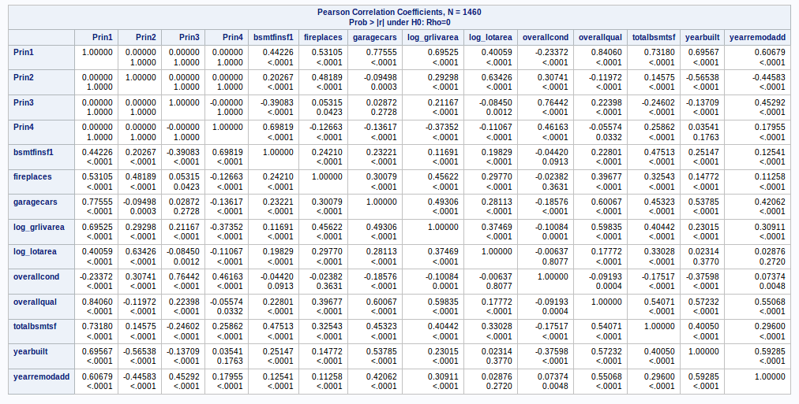
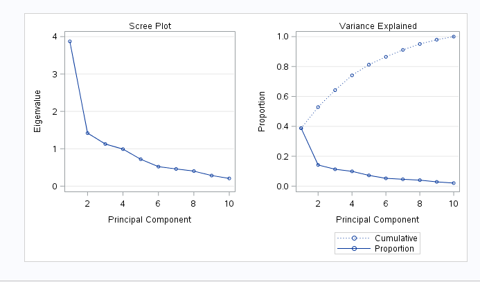

#### __Statement of Problem__  

Estimating market value of a home for sale has significant implications for all parties involved in the transaction : seller, buyer, agents, mortgage providers and even local taxing authorities. Getting it right can improve local economies. Inefficiencies associated to historical methods of value assessments create hesitation on the part of buyers and lenders, and potential loss of revenue for sellers and agents. Developing a model that considers all available factors and provides a transparent valuation that can be shared among all parties in the transaction can enable the participants to proceed with increased confidence, thus increasing the velocity of the local real estate market.  
That is the purpose of this evaluation : use all available contributing factors for the residnetial real estate market in Ames, Iowa and create a predicitve model to better estimate market valuation for future properties to be proposed for sale.  
  
***  

#### __Data Available & Utilized__  

For this evaluation, there are seventy-nine explanatory variables available for exploitation, based on residential sales in the years 2006 trough 2010, comprising approximately 1500 sales. The explanatory variables include traditional expected characteristics, such as : neighborhood, square footage, number of bedrooms, number of bathrooms, etc. and also several factors that are perhaps considered secondary or tertiary, but are included in the modeling to increase predictive capability. Some of these additional factors include : heating type, number of fireplaces, qualitative assessment of the kitchen condition.  
  
***  
  
#### __Model Construction__  

In order to build the model, the following steps are taken :  
* read in the raw training data set provided,  
* basic cleaning of the data, including removing significant outliers (for this purpose, more than 5 std deviations from mean)  
* imputing values for features where none was provided (for this purpose, setting to mean value for numeric features, and creating a new factor level "None" for categorical features),  
 * plot and visually examine each feature in relation to log(SalePrice) ...  
+ this provides a basis for removing some features from consideration based on inspection  
  	+ some features may have 1400 / 1460 within same category, thus not providing variability worthwhile including in a model  
  	+ some numerical features are sparsely populated, and the the few values visually exhibit zero slope in relation to log(SalePrice)  
  	+ a new feature was created "saledate" from the "year sold" and "month sold" features. Upon visual examination, there was no obvious trend in the time series view for  log(SalePrice)s, so this was eventually discarded   
  	+ this visual examination then results in eliminating approximately 25 of the features from consideration in the model.  
  	+ (All of the plots are available for review at the referenced GitHub site : "homes_train_plots.pdf")

***  

#### __Prior Models Considered and Results__  

In all cases, the basic data set consists of 52 predictor variables and the dependent output variable log(SalePrice)

Four different models are built :  
	*		Stepwise  - modeled in SAS proc glmselect  
	*		Forward   - modeled in SAS proc glmselect  
	*		Backward  - modeled in SAS proc glmselect  
	*		CUSTOM 	-   model based on the above three models ... just average the results of these models and see if this improves the Kaggle score.  
  

 Model           | Adj R²      |  CV Press  | Kaggle Score  
---------------- | ------------|------------|--------------
Forward          |   0.91      |   22.10    |  0.189  
Backward         |   0.92      |   23.17    |  0.226  
Stepwise         |   0.91      |   22.13    |  0.133 
Custom           |   0.90      |            |  0.225
PCA_1            |             |            |  0.15

***  			
  
### __Prior Conclusion:__   

* For this effort, the 4 models each provide good predictive capability for estimating market valuation of residential real estate to be proposed for offering in the Ames, Iowa market.  
* The stepwise model outperformed the other selection methods for the features chosen in this case. In addition, the stepwise selection also resulted in the least number of features (14) in comparison, also providing a simpler model. The table above shows the characteristics relative to model fit, along with the Kaggle scores when the model is applied to the test case data set. Clearly, the stepwise model selection is the preferred model among those evaluated.
  
  
The retained features in the final model include :  

 Feature        | Feature      | Feature    |  Feature     | Feature    
----------------|--------------|------------|--------------|-------------  
 bsmtfinsf1     | centralair   | fireplaces | garagecars   | kitchenqual  
 log(grlivarea) | log(lotarea) | mszoning   | neighborhood | overallcond  
 overallqual    | totalbsmtsf  | yearbuilt  | yearremodadd |  
 
 
***  
***  
***

### __2. Principal Components (40%)__  

***  
#####- __address the assumptions of principal components:__  
 
 The assumptions are the same as those used in regular multiple regression [¹]:   
 *	linearity,  
 * 	constant variance (no outliers), and  
 *	independence.  
 *	Since PC regression does not provide confidence limits, normality need not be assumed.  
 
 From the modeling that was completed previously, the linearity of the model and (mostly) constant variance were demonstrated.
 
 * Linearity: The predicted vs. actual model from the prior linear regression modeling shows a very good fit, and strong linear response characteristics. In addition, the residuals plot do not show any obvious tendency towards non-linearity or increasing / decreasing variance across the range of values evaluated. The assumption of linearity appears respected for this model. When the final model is constucted again here, these will be re-assessed, but we can state that the available features used to contruct a multi-variate linear regression model previously demonstrated satisfactory characteristics with regards to linearity.

* Equal variance: Similarly, from the prior modeling, the residuals plot and the studentized residuals plots both show that, within reasonable bounds, equal variances here are acceptable.

* Cook's D and the Leverage Plots showed a few influential points. The leverage plot, in particular, shows 2 points with relatively high leverage; however in this model, with 1400+ additional data points, the influence of these 2 points is not substantial.

* Relative to independence of the dependent responses (sale prices), we are assuming that with 1400+ single family residential home sales that the actions are reasonably independent. One can imagine a scenario where a  developer acquires a large number of properties in a short period of time for a specific development project or a government project forces local project, but with 1400+ sales registered for this training set, and with no evidence to the contrary, we will make the assumption that independence is sufficiently respected with this data set.
 	
 	[¹]: (https://ncss-wpengine.netdna-ssl.com/.../Procedures/NCSS/Principal_Components_Regression.pdf)  
 	
***  

##### __produce the interpretations of the eigenvalues__   
 
   
 
 
 
 The table above provides a basis to interpret the principal components of one of the sets of principal components evaluated in this model. As an example, this table includes a PCA set for a model with just 10 of the features included and the Pearson's correlation coefficient for the 1st four principal components. With more features, the explanation becomes a bit more cumbersome, so we will provide details for this case, and the method of interpretation for larger set models follows the same method. 
 The following observations can be made about this set of principal components :  
 
 * __PC_1__ : Strongest contributions from Overall_Quality, Number_of_Cars_Garage, and Total_Basement_Sq_Ft. In a sense, these are the high value characteristics of the home price market.  
   
 * __PC_2__ : Strong (negative) contributors from Year_Built and Year_Remodelled. This principal component is essentially the age feature of the home value - the newer the home and the more recently remodelled adds incremental value accounted for by PC_2.  
   
 * __PC_3__ : Strongest contribution from Overall_Condition. We oberved that Overall_Quality is not well correlated with Overall_Condition. This PC_3 is adding the value associated to whatever is the difference between _Condition and _Quality, in contrast to the _Quality value that is associated to PC_1.  
   
 * __PC_4__ : Strong contribution from Basment_Finish_Sq-Ft. We observed that basement and home size increase home sale prices in this market. This PC is accounting for a contribution from that type home feature.  
   
 * For __PC_5__ through __PC_10__, the relative weights of the individual independent variables are depicted in the below bar graph, with the relative correlation of each feature to that principal component indicated by the height of the associated color in the bar graph. In this case, we can see that among the ten features included they form natural sub-groups with two features each :
 	- age related (year built, year remodeled)
 	- amenities (garage size, fireplace)
 	- basement features 
 	- size, area
 	- quality and condition indicators.  
 	
	The different hues of the same color identify features that can be logically associated (e.g., year_remodelled and year_built can both be associated to the idea of _age_).  
 
  

***  
 
 * __screeplots__,    
 
 The scree plot associated to these principal components is shown below. This relationship indicates relative weight of the eigenvales for the the principal components. It can be observed that 1st principal component has value of 3.8; the second principal component has value of 1.4 and each succeeding value progressively less. The sum of these eigenvalues is 10, corresponding to the number of principal components. The plot on the right shows the relative increase in variance explained (among the independent variables) for the successive addition of each principal component. The first five principal components can account for 80% of the variation in the data and 7 components can account for 90% of the variation.
 
  


***  
 

### __This needs to be done -->__  
Furthermore, the investigation of the use of PCA in this project should be used in conjunction with the regression techniques you have already been using (adding categorical variables, investigating OLS, LASSO and coefficients, cross validation, variable selection, etc.)  

The team with the best Kaggle score this time around will again earn an extra 3 points.   Simply provide the same table you filled out before with your new scores as well as the code you used to generate it.  As before, only techniques we have learned in this class can be used.  
		


***
***

#### __Conclusion/Discussion Required__  
		The conclusion should reprise the questions and conclusions of the introduction,
perhaps augmented by some additional observations or details gleaned from the analysis
section. New questions, future work, etc., can also be raised here.  


***

##### __Appendix Required__  
	Well commented SAS Code Required  
	
	
##### __PCA Analysis__  

```{r, tidy = FALSE, eval = FALSE, highlight = TRUE }


proc datasets lib=work kill nolist memtype=data;
quit;

/* ...	read in training data set	... */

FILENAME REFFILE '/folders/myfolders/stats_i/training_set_cleaned.csv';

PROC IMPORT DATAFILE = REFFILE
	DBMS = CSV
	OUT = home_prices;
	GETNAMES = yes;
RUN;

PROC CONTENTS DATA = home_prices; RUN;

/* ...	read in test data set	... */

filename reffile '/folders/myfolders/stats_i/test_set_cleaned.csv';

proc import datafile = REFFILE
	DBMS = csv
	OUT = test_set;
	GETNAMES = yes;
RUN;

PROC CONTENTS DATA = test_set; RUN;

/* ...	combine train and test data sets		... */

data train_test;
 set home_prices test_set;
run;

/* ...	scatter plots					... */
/* dependent response : log_saleprice	... */

/*
proc sgscatter data = home_prices;
  matrix fullbath
		garagecars
		log_lotfrontage
		overallcond
		overallqual
		log_grlivarea
		totrmsabvgrd
		log_lotarea
		log_saleprice
		garagearea
		bsmtfinsf1
		x2ndflrsf
		totalbsmtsf
		x1stflrsf
		grlivarea
		yearbuilt
		yearremodadd
		/ diagonal=(histogram normal); 
run;
*/

/********************************************************
			second model with principal components
********************************************************/

title 'PCR Using CrossValidation for Component Selection - all selected variables';
proc pls data = home_prices method = pcr cv = one cvtest (stat=press);
class housestyle
		garagetype
		masvnrtype
		neighborhood
		heatingqc
		bsmtqual
		exterqual
		kitchenqual
		bsmtfintype1
		fireplacequ
		foundation
		lotshape
		garagefinish
		mszoning
		electrical
		exterior1st
		exterior2nd
		saletype
		centralair;
model log_saleprice = 
	/*		continuous variables	*/
		fullbath
		garagecars
		log_lotfrontage
		overallcond
		overallqual
		log_grlivarea
		totrmsabvgrd
		log_lotarea
		garagearea
		bsmtfinsf1
		x2ndflrsf
		totalbsmtsf
		x1stflrsf
		grlivarea
		yearbuilt
		yearremodadd
	/*		categorical variables	*/
		housestyle
		garagetype
		masvnrtype
		neighborhood
		heatingqc
		bsmtqual
		exterqual
		kitchenqual
		bsmtfintype1
		fireplacequ
		foundation
		lotshape
		garagefinish
		mszoning
		electrical
		exterior1st
		exterior2nd
		saletype
		centralair;
run;

title 'PCR Using Selected Factors';
proc pls data = train_test method = pcr nfact = 11;
class housestyle
		garagetype
		masvnrtype
		neighborhood
		heatingqc
		bsmtqual
		exterqual
		kitchenqual
		bsmtfintype1
		fireplacequ
		foundation
		lotshape
		garagefinish
		mszoning
		electrical
		exterior1st
		exterior2nd
		saletype
		centralair;
model log_saleprice = 
	/*		continuous variables	*/
		fullbath
		garagecars
		log_lotfrontage
		overallcond
		overallqual
		log_grlivarea
		totrmsabvgrd
		log_lotarea
		garagearea
		bsmtfinsf1
		x2ndflrsf
		totalbsmtsf
		x1stflrsf
		grlivarea
		yearbuilt
		yearremodadd
	/*		categorical variables	*/
		housestyle
		garagetype
		masvnrtype
		neighborhood
		heatingqc
		bsmtqual
		exterqual
		kitchenqual
		bsmtfintype1
		fireplacequ
		foundation
		lotshape
		garagefinish
		mszoning
		electrical
		exterior1st
		exterior2nd
		saletype
		centralair;
		output out = result p = Predict;
run;

/* create kaggle submission file */
/* two columns with appropriate labels. */

proc means data = result Min Max;
run;

proc means data = result noprint;
	var Predict;
    output out = means mean(Predict) = mean_predict;
run;

data kaggle_submit;
set result;
SalePrice = exp(Predict);
if Predict = . then SalePrice = exp(12.018);
keep id SalePrice;
where id > 1460;
run;

proc export data = kaggle_submit replace
   outfile = '/folders/myfolders/stats_ii/kaggle_submit_pca.1.csv'
   dbms = csv;
run;


```

