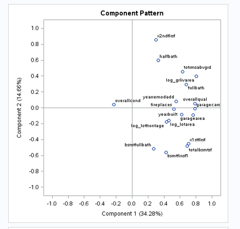
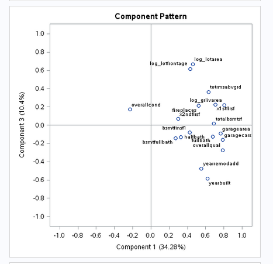
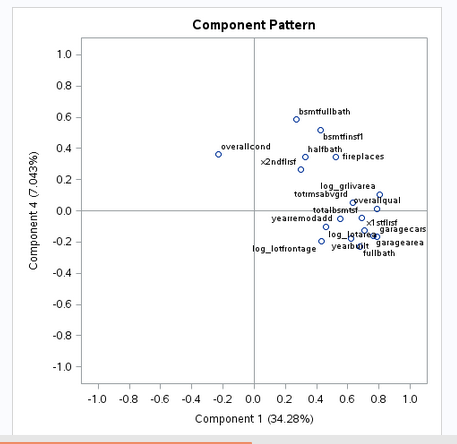

---
title: "project_2 - appendix"
author: "msds 6372 - preeti swaminathan & patrick mcdevitt"
date: "30 july 2017"
output:
  html_document:
    theme: united
    highlight: tango
--- 


\pagebreak  

<P style="page-break-before: always">  

***

##### __Appendix__  

\pagebreak  

<P style="page-break-before: always">  
	
	
##### __PC Loading Plots__  

  
 



##### __SAS Code for principal components regression analysis__  

```{r, tidy = FALSE, eval = FALSE, highlight = TRUE }

/*	-=-=-=-=-=-=-=-=-=-=-=-=-=-=-=-=-=-=-=-=-=-=-=-=-=-=-=-=-=-=-=-=-=-=-=-=- */
/* ...	Principal Components Regression			... */
	
/*	kaggle home prices data set
/*	patrick mcdevitt
/*	29-jul-2017
/*	-=-=-=-=-=-=-=-=-=-=-=-=-=-=-=-=-=-=-=-=-=-=-=-=-=-=-=-=-=-=-=-=-=-=-=-=- */


/*	-=-=-=-=-=-=-=-=-=-=-=-=-=-=-=-=-=-=-=-=-=-=-=-=-=-=-=-=-=-=-=-=-=-=-=-=- */
/* ...	start with clean memory	... */
/*	-=-=-=-=-=-=-=-=-=-=-=-=-=-=-=-=-=-=-=-=-=-=-=-=-=-=-=-=-=-=-=-=-=-=-=-=- */

proc datasets lib=work kill nolist memtype=data;
quit;

/*	-=-=-=-=-=-=-=-=-=-=-=-=-=-=-=-=-=-=-=-=-=-=-=-=-=-=-=-=-=-=-=-=-=-=-=-=- */
/* ...	read in training data set	... */
/*	-=-=-=-=-=-=-=-=-=-=-=-=-=-=-=-=-=-=-=-=-=-=-=-=-=-=-=-=-=-=-=-=-=-=-=-=- */

FILENAME REFFILE '/folders/myfolders/stats_ii/training_set_cleaned.csv';

PROC IMPORT DATAFILE = REFFILE
	DBMS = CSV
	OUT = home_prices;
	GETNAMES = yes;
RUN;

/*	-=-=-=-=-=-=-=-=-=-=-=-=-=-=-=-=-=-=-=-=-=-=-=-=-=-=-=-=-=-=-=-=-=-=-=-=- */
/* ...	read in test data set	... */
/*	-=-=-=-=-=-=-=-=-=-=-=-=-=-=-=-=-=-=-=-=-=-=-=-=-=-=-=-=-=-=-=-=-=-=-=-=- */

filename reffile '/folders/myfolders/stats_ii/test_set_cleaned.csv';

proc import datafile = REFFILE
	DBMS = csv
	OUT = test_set;
	GETNAMES = yes;
RUN;

/*	-=-=-=-=-=-=-=-=-=-=-=-=-=-=-=-=-=-=-=-=-=-=-=-=-=-=-=-=-=-=-=-=-=-=-=-=- */
/* ...	combine train and test data sets		... */
/*	-=-=-=-=-=-=-=-=-=-=-=-=-=-=-=-=-=-=-=-=-=-=-=-=-=-=-=-=-=-=-=-=-=-=-=-=- */

data train_test;
 set home_prices test_set;
run;

title 'PCA for all (selected) independent numeric variables in training set';
proc princomp data = train_test out = pc_home_prices;
var bsmtfinsf1
	bsmtfullbath
	fireplaces
	fullbath
	garagearea
	garagecars
	halfbath
	log_grlivarea
	log_lotarea
	log_lotfrontage
	overallcond
	overallqual
	totalbsmtsf
	totrmsabvgrd
	x1stflrsf
	x2ndflrsf
	yearbuilt
	yearremodadd;
run;

proc print data = pc_home_prices;
run;

/********************************************************
			model with principal components + categoricals
********************************************************/

title 'Regression (stepwise) with full PC set + categorical variables';
proc glmselect data = pc_home_prices plots = (criteria) seed = 3;
class bsmtfintype1
	bsmtqual
	centralair
	electrical
	exterior1st
	exterior2nd
	exterqual
	fireplacequ
	foundation
	garagefinish
	garagetype
	heatingqc
	housestyle
	kitchenqual
	lotshape
	masvnrtype
	mszoning
	neighborhood
	saletype;	
model log_saleprice = 
	/*		continuous variables	*/
	prin1-prin18
	/*		categorical variables	*/
	bsmtfintype1
	bsmtqual
	centralair
	electrical
	exterior1st
	exterior2nd
	exterqual
	fireplacequ
	foundation
	garagefinish
	garagetype
	heatingqc
	housestyle
/*	kitchenqual	*/
	lotshape
	masvnrtype
/*	mszoning 	*/
	neighborhood
	saletype / selection = stepwise(choose = CV select = cv stop = aic);
output out = result p = Predict;
run;

/*	-=-=-=-=-=-=-=-=-=-=-=-=-=-=-=-=-=-=-=-=-=-=-=-=-=-=-=-=-=-=-=-=-=-=-=-=- */
/* create kaggle submission file */
/* two columns with appropriate labels. */
/*	-=-=-=-=-=-=-=-=-=-=-=-=-=-=-=-=-=-=-=-=-=-=-=-=-=-=-=-=-=-=-=-=-=-=-=-=- */

proc means data = result Min Max;
run;

proc means data = result noprint;
	var Predict;
    output out = means mean(Predict) = mean_predict;
run;

/*	-=-=-=-=-=-=-=-=-=-=-=-=-=-=-=-=-=-=-=-=-=-=-=-=-=-=-=-=-=-=-=-=-=-=-=-=- */
/* 	in case any missing values in predicted set,			*/
/*		impute with mean of predicted sale prices			*/
/*	-=-=-=-=-=-=-=-=-=-=-=-=-=-=-=-=-=-=-=-=-=-=-=-=-=-=-=-=-=-=-=-=-=-=-=-=- */

data kaggle_submit;
set result;
SalePrice = exp(Predict);
if Predict = . then SalePrice = exp(12.024);
keep id SalePrice;
where id > 1460;
run;

proc export data = kaggle_submit replace
   outfile = '/folders/myfolders/stats_ii/kaggle_submit_pca_step.1.csv'
   dbms = csv;
run;

/*	-=-=-=-=-=-=-=-=-=-=-=-=-=-=-=-=-=-=-=-=-=-=-=-=-=-=-=-=-=-=-=-=-=-=-=-=- */
/* 	...		end_of_file														*/
/*	-=-=-=-=-=-=-=-=-=-=-=-=-=-=-=-=-=-=-=-=-=-=-=-=-=-=-=-=-=-=-=-=-=-=-=-=- */


```

