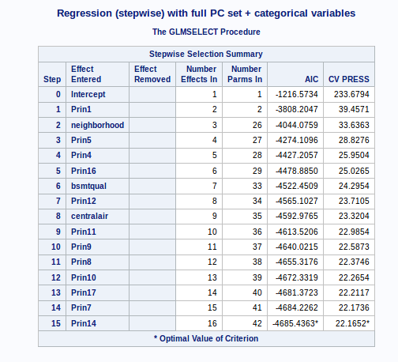
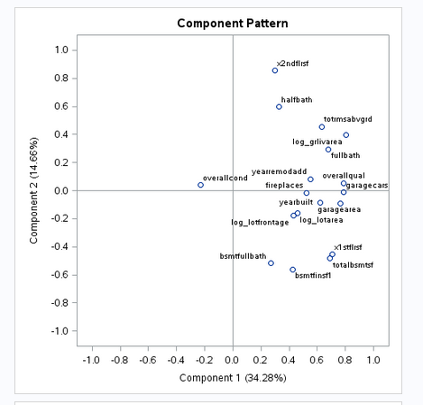
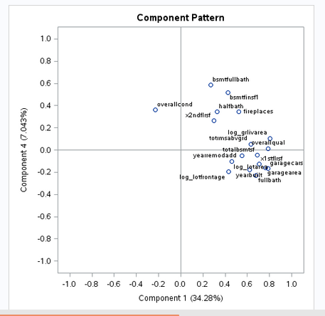

---
title: "project_2 - home prices - pca & lda"
author: "msds 6372 - preeti swaminathan & patrick mcdevitt"
date: "30 july 2017"
output:
  html_document:
    theme: united
    highlight: tango
--- 

***  


#### __Statement of Problem__  

Estimating market value of a home for sale has significant implications for all parties involved in the transaction : seller, buyer, agents, mortgage providers and even local taxing authorities. Getting it right can improve local economies. Inefficiencies associated to historical methods of value assessments create hesitation on the part of buyers and lenders, and potential loss of revenue for sellers and agents. Developing a model that considers all available factors and provides a transparent valuation that can be shared among all parties in the transaction can enable the participants to proceed with increased confidence, thus increasing the velocity of the local real estate market.  
That is the purpose of this evaluation : use all available contributing factors for the residential real estate market in Ames, Iowa and create a predicitve model to better estimate market valuation for future properties to be proposed for sale.  

This summary is a follow-on to the summary that was provided last semester. In light of the previous summary provided, the focus of this document will be to augment, and not repeat, what was previously documented.
  
***  

#### __Data Available & Utilized__  

For this evaluation, there are seventy-nine explanatory variables available for exploitation, based on residential sales in the years 2006 trough 2010, comprising approximately 1500 sales. The explanatory variables include traditional expected characteristics, such as : neighborhood, square footage, number of bedrooms, number of bathrooms, etc. and also several factors that are perhaps considered secondary or tertiary, but are included in the modeling to increase predictive capability. Some of these additional factors include : heating type, number of fireplaces, qualitative assessment of the kitchen condition.  
  
***  
  
#### __Model Construction__  

In order to build the model, the following steps are taken :  

* read in the raw training data set provided,  
* basic cleaning of the data, including removing significant outliers (for this purpose, more 	than 5 std deviations from mean)  
* imputing values for features where none was provided (for this purpose, setting to mean value for numeric features, and creating a new factor level "None" for categorical features),  
* for the __PCA prediction model__: plot and visually examine each feature in relation to log(SalePrice) ...  
	+ this provides a basis for removing some features from consideration based on inspection  
	+ some features may have 1400 / 1460 within same category, thus not providing variability worthwhile including in a model  
	+ some numerical features are sparsely populated, and the the few values visually exhibit zero slope in relation to log(SalePrice)  
	+ this visual examination then results in eliminating approximately 25 of the features from consideration in the model.  
* for the __LDA foundation estimating model__: a similar approach to the above was taken, except each numerical (continuous) variable was evaluated in relation to the feature _foundation type_. This was accomplished by   
	+ reviewing the histogram of that feature for range of variability  
	+ creating boxplot (essentially ANOVA) of each feature vs. foundation type  
	+ features showing differentiation among the different foundation types were retained for the LDA model.  
	+ this resulted in retaining approx 20 features for evaluation of the foundation type LDA model.  
* The data cleaning, visualizations, and preparation of the full cleaned data set were accomplished in R,  
* The statistical analyses were then conducted in SAS  
	
* All of the plots for both of these visual evalutions are available for review at the referenced GitHub site :  
	+ for the PCR model : https://github.com/bici-sancta/home_prices/blob/master/data/homes_train_plots.pdf  
	+ for the LDA model : https://github.com/bici-sancta/home_prices/blob/master/data/homes_train_foundation_boxplots.pdf  
* All of the R code that produced the visualizations and prepared the cleaned data sets are also available at the same GitHub site : https://github.com/bici-sancta/home_prices/blob/master/data/training_set_data_prep.Rmd  


***  

#### __Prior Models Considered and Results__  

From the evaluation that was completed in April-2017, we noted that the basic data set consists of 52 predictor variables and the dependent output variable log(SalePrice)

Four different models were built :  
	*		Stepwise  - modeled in SAS proc glmselect  
	*		Forward   - modeled in SAS proc glmselect  
	*		Backward  - modeled in SAS proc glmselect  
	*		CUSTOM 	-   model based on the average of above three models  
  
The results of that evaluation produced the following results :  

 Model           | Adj R²      |  CV Press  | Kaggle Score  
---------------- | ------------|------------|--------------
Forward          |   0.91      |   22.10    |  0.189  
Backward         |   0.92      |   23.17    |  0.226  
Stepwise         |   0.91      |   22.13    |  0.133 
Custom           |   0.90      |            |  0.225

***  			
  
### __Prior Conclusion:__   

* From this effort, the 4 models each provided good predictive capability for estimating market valuation of residential real estate to be proposed for offering in the Ames, Iowa market.  
* The stepwise model outperformed the other selection methods for the features chosen in this case. In addition, the stepwise selection also resulted in the least number of features (14) in comparison, also providing a simpler model. The table above shows the characteristics relative to model fit, along with the Kaggle scores when the model is applied to the test case data set. Clearly, the stepwise model selection is the preferred model among those evaluated.
  
  
The retained features in the final OLS model included :  

 Feature        | Feature      | Feature    |  Feature     | Feature    
----------------|--------------|------------|--------------|-------------  
 bsmtfinsf1     | centralair   | fireplaces | garagecars   | kitchenqual  
 log(grlivarea) | log(lotarea) | mszoning   | neighborhood | overallcond  
 overallqual    | totalbsmtsf  | yearbuilt  | yearremodadd |  
 
 
***  
***  
***

#### Moving forward, we now apply the method of principal components and evaluate improvements that can be achieved to the basic OLS model.

### __2. Principal Components__  

***  
##### __address the assumptions of principal components:__  
 
 The assumptions are the same as those used in regular multiple regression [¹]:   
 *	linearity,  
 * 	constant variance (no outliers), and  
 *	independence.  
 *	Since PC regression does not provide confidence limits, normality need not be assumed.  
 
 From the modeling that was completed previously, the linearity of the model and (mostly) constant variance were demonstrated.
 
 * Linearity: The predicted vs. actual model from the prior linear regression modeling shows a very good fit, and strong linear response characteristics. In addition, the residuals plot do not show any obvious tendency towards non-linearity or increasing / decreasing variance across the range of values evaluated. The assumption of linearity appears respected for this model. We can state that the available features used to contruct a multi-variate linear regression model previously demonstrated satisfactory characteristics with regards to linearity.

* Equal variance: Similarly, from the prior modeling, the residuals plot and the studentized residuals plots both show that, within reasonable bounds, equal variances here are acceptable.

* Cook's D and the Leverage Plots showed a few influential points. The leverage plot, in particular, shows 2 points with relatively high leverage; however in this model, with 1400+ additional data points, the influence of these 2 points is not substantial.

* Relative to independence of the dependent responses (sale prices), we are assuming that with 1400+ single family residential home sales that the actions are reasonably independent. One can imagine a scenario where a  developer acquires a large number of properties in a short period of time for a specific development project or a government project forces local dependent market sales, but with 1400+ sales registered for this training set, and with no evidence to the contrary, we will make the assumption that independence is sufficiently respected with this data set.
 	
[¹]: (https://ncss-wpengine.netdna-ssl.com/.../Procedures/NCSS/Principal_Components_Regression.pdf)  
 	
***  
### __Principal Components Regression Model__   

The method used to develop a PCR model in this case is as follows :  

* begin with the same (down-selected) candidate predictor variables based on review of data plots and univariate regression r² values as described above. This provides a beginning candidate set of :  

	+ 18 continuous variables  
	+ 19 categorical variables  
	+ Full list can be found here : https://github.com/bici-sancta/home_prices/blob/master/data/pca%20model%20data%20dictionary.csv  
	
* principal components were generated for the continuous variable set (18 principal components)  
* the principal components and the categorical variables were then included in a GLM modeling, using  
	+ stepwise selection method with  
	+ cross validation and  
	+ stop criteria of AIC.  
* the __stepwise__ selection method was chosen because that method provided the best model in the previous exercise using OLS methods. Therefore, this evaluation is also using the stepwise method as a means to make a comparison with the previous modeling activity _best results_.  

The model seletected by this method includes 12 of the possible 18 principal components and 3 of the categorical variables (neighborhood, bsmtqual, centralair) :  

<table align = "center" border = "1">
<tr>
<td> __Parameter selection process__
<td> __Model fit scores__
</tr>
<tr>
<td>   
<td> 
</tr>
</table>

***  

##### __eigenvalues/eignevectors__   
 
   
 
 
 
 The table above provides a basis to interpret the principal components of a slightly simpler model than the full model, used here for interpretaton purposes.  As an example, this table includes a PCA set for a model with the features included and the Pearson's correlation coefficient for the 1st four principal components. With more features, the explanation becomes a bit more cumbersome, so we will provide details for a few features here, and the method of interpretation for remaining features follows the same method. 
 The following observations can be made about this set of principal components :  
 
 * __PC_1__ : Strongest contributions from Overall_Quality, Number_of_Cars_Garage, and Total_Basement_Sq_Ft. In a sense, these are the high value characteristics of the home price market.  
   
 * __PC_2__ : Strong (negative) contributors from Year_Built and Year_Remodelled. This principal component is essentially the age feature of the home value - the newer the home and the more recently remodelled adds incremental value accounted for by PC_2.  
   
 * __PC_3__ : Strongest contribution from Overall_Condition. We oberved that Overall_Quality is not well correlated with Overall_Condition. This PC_3 is adding the value associated to the difference between _Condition and _Quality, in contrast to the _Quality value that is associated to PC_1.  From the data definitions, the overall quality is related to material and finish quality while overall condition is an overall condition rating.  
   
 * __PC_4__ : Strong contribution from Basment_Finish_Sq-Ft. We observed that basement and home size increase home sale prices in this market. This PC is accounting for a contribution from that type home feature.  
   
 * For __PC_5__ through __PC_10__, the relative weights of the individual independent variables are depicted in the below bar graph, with the relative correlation of each feature to that principal component indicated by the height of the associated color in the bar graph. In this case, we can see that among the ten features included they form natural sub-groups with two features each :
 	- age related (year built, year remodeled)
 	- amenities (garage size, fireplace)
 	- basement features 
 	- size, area
 	- quality and condition indicators.  
 	
	The different hues of the same color identify features that can be logically associated (e.g., year_remodelled and year_built can both be associated to the idea of _age_).  
 
  

***  
 
 * __screeplots__    
 
 The scree plot associated to the principal components is shown below. This relationship indicates relative weight of the eigenvales for the the principal components. It can be observed that 1st principal component has value of 6.1; the second principal component has value of 2.6 and each succeeding value progressively less. The sum of these eigenvalues is 18, corresponding to the number of principal components. The plot on the right shows the relative increase in variance explained (among the independent variables) for the successive addition of each principal component. The first five principal components can account for 65% of the variation in the data and 10 components can account for 90% of the variation.
 
  


***  


The results of that model, in comparison to the prior OLS model, are as follows : 

 Model           | Adj R²      |  CV Press  | Kaggle Score  
---------------- | ------------|------------|--------------
OLS Stepwise     |   0.91      |   22.13    |  0.133 
PCR Stepwise     |   0.91      |   22.17    |  0.127


***
***

#### __Conclusion__  

The PCR regression model provides similar (actually, slightly better) results as obtained from the OLS model developed in a similar fashion (and using the same stepwise selection method). The OLS model required 14 features to produce a model with kaggle score of 0.13. The PCR model required 12 principal components plus 3 categorical variables results in a model with one additional component in comparison. Interestingly, the stepwise selection process did not result in selecting only the lower order principal components, e.g., PCs 2, 3, and 6 were not retained, whereas PCs 4, 5, and 7 were.  
The interpretation of the principal components is not obvious in this case, as most principal components have loadings from several features.  
PC_5 does uniquely show a heavy loading for overall condition, so it does facilitate that interpretation.  
  

Several of the loadings plots are included in the appendices.  
The categorical features retained with PCR stepwise model are consistent with the categorical features retained in the OLS stepwise model.  
Overall, the PCR model produced results consistent the OLS model of similar development method.


***

\pagebreak

<P style="page-break-before: always">

***

##### __Appendix__  

\pagebreak
	
	
##### __PC Loading Plots__  

  
 



##### __SAS Code for principal components regression analysis__  

```{r, tidy = FALSE, eval = FALSE, highlight = TRUE }

/*	-=-=-=-=-=-=-=-=-=-=-=-=-=-=-=-=-=-=-=-=-=-=-=-=-=-=-=-=-=-=-=-=-=-=-=-=- */
/* ...	Principal Components Regression			... */
	
/*	kaggle home prices data set
/*	patrick mcdevitt
/*	29-jul-2017
/*	-=-=-=-=-=-=-=-=-=-=-=-=-=-=-=-=-=-=-=-=-=-=-=-=-=-=-=-=-=-=-=-=-=-=-=-=- */


/*	-=-=-=-=-=-=-=-=-=-=-=-=-=-=-=-=-=-=-=-=-=-=-=-=-=-=-=-=-=-=-=-=-=-=-=-=- */
/* ...	start with clean memory	... */
/*	-=-=-=-=-=-=-=-=-=-=-=-=-=-=-=-=-=-=-=-=-=-=-=-=-=-=-=-=-=-=-=-=-=-=-=-=- */

proc datasets lib=work kill nolist memtype=data;
quit;

/*	-=-=-=-=-=-=-=-=-=-=-=-=-=-=-=-=-=-=-=-=-=-=-=-=-=-=-=-=-=-=-=-=-=-=-=-=- */
/* ...	read in training data set	... */
/*	-=-=-=-=-=-=-=-=-=-=-=-=-=-=-=-=-=-=-=-=-=-=-=-=-=-=-=-=-=-=-=-=-=-=-=-=- */

FILENAME REFFILE '/folders/myfolders/stats_ii/training_set_cleaned.csv';

PROC IMPORT DATAFILE = REFFILE
	DBMS = CSV
	OUT = home_prices;
	GETNAMES = yes;
RUN;

/*	-=-=-=-=-=-=-=-=-=-=-=-=-=-=-=-=-=-=-=-=-=-=-=-=-=-=-=-=-=-=-=-=-=-=-=-=- */
/* ...	read in test data set	... */
/*	-=-=-=-=-=-=-=-=-=-=-=-=-=-=-=-=-=-=-=-=-=-=-=-=-=-=-=-=-=-=-=-=-=-=-=-=- */

filename reffile '/folders/myfolders/stats_ii/test_set_cleaned.csv';

proc import datafile = REFFILE
	DBMS = csv
	OUT = test_set;
	GETNAMES = yes;
RUN;

/*	-=-=-=-=-=-=-=-=-=-=-=-=-=-=-=-=-=-=-=-=-=-=-=-=-=-=-=-=-=-=-=-=-=-=-=-=- */
/* ...	combine train and test data sets		... */
/*	-=-=-=-=-=-=-=-=-=-=-=-=-=-=-=-=-=-=-=-=-=-=-=-=-=-=-=-=-=-=-=-=-=-=-=-=- */

data train_test;
 set home_prices test_set;
run;

title 'PCA for all (selected) independent numeric variables in training set';
proc princomp data = train_test out = pc_home_prices;
var bsmtfinsf1
	bsmtfullbath
	fireplaces
	fullbath
	garagearea
	garagecars
	halfbath
	log_grlivarea
	log_lotarea
	log_lotfrontage
	overallcond
	overallqual
	totalbsmtsf
	totrmsabvgrd
	x1stflrsf
	x2ndflrsf
	yearbuilt
	yearremodadd;
run;

proc print data = pc_home_prices;
run;

/********************************************************
			model with principal components + categoricals
********************************************************/

title 'Regression (stepwise) with full PC set + categorical variables';
proc glmselect data = pc_home_prices plots = (criteria) seed = 3;
class bsmtfintype1
	bsmtqual
	centralair
	electrical
	exterior1st
	exterior2nd
	exterqual
	fireplacequ
	foundation
	garagefinish
	garagetype
	heatingqc
	housestyle
	kitchenqual
	lotshape
	masvnrtype
	mszoning
	neighborhood
	saletype;	
model log_saleprice = 
	/*		continuous variables	*/
	prin1-prin18
	/*		categorical variables	*/
	bsmtfintype1
	bsmtqual
	centralair
	electrical
	exterior1st
	exterior2nd
	exterqual
	fireplacequ
	foundation
	garagefinish
	garagetype
	heatingqc
	housestyle
/*	kitchenqual	*/
	lotshape
	masvnrtype
/*	mszoning 	*/
	neighborhood
	saletype / selection = stepwise(choose = CV select = cv stop = aic);
output out = result p = Predict;
run;

/*	-=-=-=-=-=-=-=-=-=-=-=-=-=-=-=-=-=-=-=-=-=-=-=-=-=-=-=-=-=-=-=-=-=-=-=-=- */
/* create kaggle submission file */
/* two columns with appropriate labels. */
/*	-=-=-=-=-=-=-=-=-=-=-=-=-=-=-=-=-=-=-=-=-=-=-=-=-=-=-=-=-=-=-=-=-=-=-=-=- */

proc means data = result Min Max;
run;

proc means data = result noprint;
	var Predict;
    output out = means mean(Predict) = mean_predict;
run;

/*	-=-=-=-=-=-=-=-=-=-=-=-=-=-=-=-=-=-=-=-=-=-=-=-=-=-=-=-=-=-=-=-=-=-=-=-=- */
/* 	in case any missing values in predicted set,			*/
/*		impute with mean of predicted sale prices			*/
/*	-=-=-=-=-=-=-=-=-=-=-=-=-=-=-=-=-=-=-=-=-=-=-=-=-=-=-=-=-=-=-=-=-=-=-=-=- */

data kaggle_submit;
set result;
SalePrice = exp(Predict);
if Predict = . then SalePrice = exp(12.024);
keep id SalePrice;
where id > 1460;
run;

proc export data = kaggle_submit replace
   outfile = '/folders/myfolders/stats_ii/kaggle_submit_pca_step.1.csv'
   dbms = csv;
run;

/*	-=-=-=-=-=-=-=-=-=-=-=-=-=-=-=-=-=-=-=-=-=-=-=-=-=-=-=-=-=-=-=-=-=-=-=-=- */
/* 	...		end_of_file														*/
/*	-=-=-=-=-=-=-=-=-=-=-=-=-=-=-=-=-=-=-=-=-=-=-=-=-=-=-=-=-=-=-=-=-=-=-=-=- */


```

