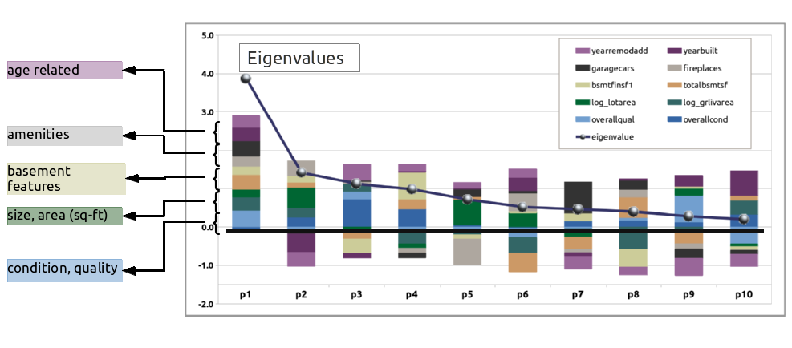
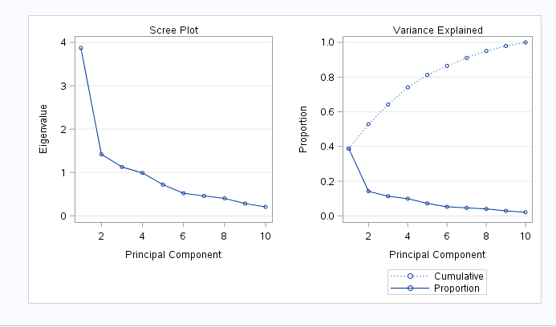
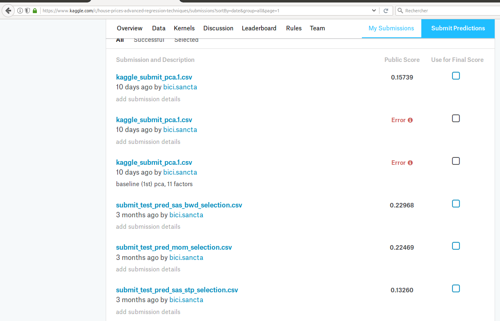

#### __Statement of Problem__  

Estimating market value of a home for sale has significant implications for all parties involved in the transaction : seller, buyer, agents, mortgage providers and even local taxing authorities. Getting it right can improve local economies. Inefficiencies associated to historical methods of value assessments create hesitation on the part of buyers and lenders, and potential loss of revenue for sellers and agents. Developing a model that considers all available factors and provides a transparent valuation that can be shared among all parties in the transaction can enable the participants to proceed with increased confidence, thus increasing the velocity of the local real estate market.  
That is the purpose of this evaluation : use all available contributing factors for the residnetial real estate market in Ames, Iowa and create a predicitve model to better estimate market valuation for future properties to be proposed for sale.  
  
***  

#### __Data Available & Utilized__  

For this evaluation, there are seventy-nine explanatory variables available for exploitation, based on residential sales in the years 2006 trough 2010, comprising approximately 1500 sales. The explanatory variables include traditional expected characteristics, such as : neighborhood, square footage, number of bedrooms, number of bathrooms, etc. and also several factors that are perhaps considered secondary or tertiary, but are included in the modeling to increase predictive capability. Some of these additional factors include : heating type, number of fireplaces, qualitative assessment of the kitchen condition.  
  
***  
  
#### __Model Construction__  

In order to build the model, the following steps are taken :  
* read in the raw training data set provided,  
* basic cleaning of the data, including removing significant outliers (for this purpose, more than 5 std deviations from mean)  
* imputing values for features where none was provided (for this purpose, setting to mean value for numeric features, and creating a new factor level "None" for categorical features),  
 * plot and visually examine each feature in relation to log(SalePrice) ...  
+ this provides a basis for removing some features from consideration based on inspection  
  	+ some features may have 1400 / 1460 within same category, thus not providing variability worthwhile including in a model  
  	+ some numerical features are sparsely populated, and the the few values visually exhibit zero slope in relation to log(SalePrice)  
  	+ a new feature was created "saledate" from the "year sold" and "month sold" features. Upon visual examination, there was no obvious trend in the time series view for  log(SalePrice)s, so this was eventually discarded   
  	+ this visual examination then results in eliminating approximately 25 of the features from consideration in the model.  
  	+ (All of the plots are available for review at the referenced GitHub site : "homes_train_plots.pdf")

***  

#### __Models Considered__  

In all cases, the basic data set consists of 52 predictor variables and the dependent output variable log(SalePrice)

Four different models are built :  
	*		Stepwise  - modeled in SAS proc glmselect  
	*		Forward   - modeled in SAS proc glmselect  
	*		Backward  - modeled in SAS proc glmselect  
	*		CUSTOM 	-   model based on the above three models ... just average the results of these models and see if this improves the Kaggle score.  
  
  ***  
  
#### __Residuals Evaluation__	   
* the following plots show the distribution of residuals and the predicted vs. the actual sale price (log scale) for the custom model. From these plots, we consider that the basic assumptions of normality in the residuals is achieved, and that the visual aspect of the fitted model aligns well with the dependent variable to be modeled. For brevity's sake, the only plots shown here are for the stepwise selction model. The residuals plots for the other models assessed were similar in nature.

			
	
#### __Influential point analysis (Cook’s D and Leverage)__  

Test for assumptions:

* Normality: From QQ plot, scatter and histogram, normality is generally respected. The residuals histogram and QQ plot show a slight tendency towards left skewness. With next modeling attempts, this is an area for potential improvement. 

* Linearity: The predicted vs. actual model shows a very good fit, and strong linear response characteristics. In addition, the residuals plot do not show any obvious tendency towards non-linearity or increasing / decreasing variance across the range of values evaluated. The assumption of linearity appears respected for this model.

* Equal variance: The residuals plot and the studentized residuals plots both show respect within reasonable bounds that equal variances here are acceptable.

* Cook's D and the Leverage Plots show a few influential points. The leverage plot, in particular, shows 2 points with relatively high leverage; however in this model, with 1400+ additional data points, the influence of these 2 points is not substantial.

***  

#### __Comparing Competing Models__  
		

 Model           | Adj R²      |  CV Press  | Kaggle Score  
---------------- | ------------|------------|--------------
Forward          |   0.91      |   22.10    |  0.189  
Backward         |   0.92      |   23.17    |  0.226  
Stepwise         |   0.91      |   22.13    |  0.133 
Custom           |   0.90      |            |  0.225
PCA_1            |             |            |  0.15

***  			
  
### __Conclusion:__   

* For this effort, the 4 models each provide good predictive capability for estimating market valuation of residential real estate to be proposed for offering in the Ames, Iowa market.  
* The stepwise model outperformed the other selection methods for the features chosen in this case. In addition, the stepwise selection also resulted in the least number of features (14) in comparison, also providing a simpler model. The table above shows the characteristics relative to model fit, along with the Kaggle scores when the model is applied to the test case data set. Clearly, the stepwise model selection is the preferred model among those evaluated.
  
  
The retained features in the final model include :  

 Feature        | Feature      | Feature    |  Feature     | Feature    
----------------|--------------|------------|--------------|-------------  
 bsmtfinsf1     | centralair   | fireplaces | garagecars   | kitchenqual  
 log(grlivarea) | log(lotarea) | mszoning   | neighborhood | overallcond  
 overallqual    | totalbsmtsf  | yearbuilt  | yearremodadd |  
 
 
***  
***  


***

#### __Introduction__ Required  

***

#### __Data Description__  Required  

***

#### __Exploratory Analysis__ Required  

***

#### __Analysis of Question 1:__  

2. Principal Components (40%)
In this section, you will attempt to better your Kaggle score through the use of principal components.  In this process you must :  

***  
#####- __address the assumptions of principal components:__  
 
 The assumptions are the same as those used in regular multiple regression [¹]:   
 *	linearity,  
 * 	constant variance (no outliers), and  
 *	independence.  
 *	Since PC regression does not provide confidence limits, normality need not be assumed.  
 
 From the modeling that was completed previously, the linearity of the model and (mostly) constant variance were demonstrated.
 
 * Linearity: The predicted vs. actual model from the prior linear regression modeling shows a very good fit, and strong linear response characteristics. In addition, the residuals plot do not show any obvious tendency towards non-linearity or increasing / decreasing variance across the range of values evaluated. The assumption of linearity appears respected for this model. When the final model is constucted again here, these will be re-assessed, but we can state that the available features used to contruct a multi-variate linear regression model previously demonstrated satisfactory characteristics with regards to linearity.

* Equal variance: Similarly, from the prior modeling, the residuals plot and the studentized residuals plots both show that, within reasonable bounds, equal variances here are acceptable.

* Cook's D and the Leverage Plots showed a few influential points. The leverage plot, in particular, shows 2 points with relatively high leverage; however in this model, with 1400+ additional data points, the influence of these 2 points is not substantial.

* Relative to independence of the dependent responses (sale prices), we are assuming that with 1400+ single family residential home sales that the actions are reasonably independent. One can imagine a scenario where a  developer acquires a large number of properties in a short period of time for a specific development project or a government project forces local project, but with 1400+ sales registered for this training set, and with no evidence to the contrary, we will make the assumption that independence is sufficiently respected with this data set.
 	
 	[¹]: (https://ncss-wpengine.netdna-ssl.com/.../Procedures/NCSS/Principal_Components_Regression.pdf)  
 	
***  

##### __produce the interpretations of the eigenvalues__   
 
   
 
 
 
 The table above provides a basis to interpret the principal components of one of the sets of principal components evaluated in this model. As an example, this table includes a PCA set for a model with just 10 of the features included and the Pearson's correlation coefficient for the 1st four principal components. With more features, the explanation becomes a bit more cumbersome, so we will provide details for this case, and the method of interpretation for larger set models follows the same method. 
 The following observations can be made about this set of principal components :  
 
 * __PC_1__ : Strongest contributions from Overall_Quality, Number_of_Cars_Garage, and Total_Basement_Sq_Ft. In a sense, these are the high value characteristics of the home price market.  
   
 * __PC_2__ : Strong (negative) contributors from Year_Built and Year_Remodelled. This principal component is essentially the age feature of the home value - the newer the home and the more recently remodelled adds incremental value accounted for by PC_2.  
   
 * __PC_3__ : Strongest contribution from Overall_Condition. We oberved that Overall_Quality is not well correlated with Overall_Condition. This PC_3 is adding the value associated to whatever is the difference between _Condition and _Quality, in contrast to the _Quality value that is associated to PC_1.  
   
 * __PC_4__ : Strong contribution from Basment_Finish_Sq-Ft. We observed that basement and home size increase home sale prices in this market. This PC is accounting for a contribution from that type home feature.  
   
 * For __PC_5__ through __PC_10__, the relative weights of the individual independent variables are depicted in the below bar graph, with the relative correlation of each feature to that principal component indicated by the height of the associated color in the bar graph. In this case, we can see that among the ten features included they form natural sub-groups with two features each :
 	- age related (year built, year remodeled)
 	- amenities (garage size, fireplace)
 	- basement features 
 	- size, area
 	- quality and condition indicators.  
 	
	The different hues of the same color identify features that can be logically associated (e.g., year_remodelled and year_built can both be associated to the idea of _age_).  
 
  

***  
 
 * __screeplots__,    
 
 The scree plot associated to these principal components is shown below. This relationship indicates relative weight of the eigenvales for the the principal components. It can be observed that 1st principal component has value of 3.8; the second principal component has value of 1.4 and each succeeding value progressively less. The sum of these eigenvalues is 10, corresponding to the number of principal components. The plot on the right shows the relative increase in variance explained (among the independent variables) for the successive addition of each principal component. The first five principal components can account for 80% of the variation in the data and 7 components can account for 90% of the variation.
 
  


***  
 
 * and other criterion that aid in selecting components.  
 
In addition, you must also attempt to interpret the components selected with respect to the sale price of the houses.  This may be tough, but do your best.  

Furthermore, the investigation of the use of PCA in this project should be used in conjunction with the regression techniques you have already been using (adding categorical variables, investigating OLS, LASSO and coefficients, cross validation, variable selection, etc.)  

The team with the best Kaggle score this time around will again earn an extra 3 points.   Simply provide the same table you filled out before with your new scores as well as the code you used to generate it.  As before, only techniques we have learned in this class can be used.  
		


***

#### __Analysis Question 2__  

3. LDA (30%)
There is not a lot of actual missing data in this data set as most of the “NA”’s simply indicate the absence of that value.  However, if there were, LDA may be a good method to impute missing categorical variables.  For this part, you will simply use the training set to build a classification model (using LDA) to predict the type of Foundation of houses in the Test Set.  To do this, I will simply select a random sample from the test set and use it to manually test your model.  Similar to the Kaggle competition, each team will provide me with the code that will both train your final classification model and provide predictions given a test set.  We will take this code and run it with the actual training set from Kaggle as well as a randomly drawn subset of the test set with the Foundation type deleted.  The winner of this competition will earn an extra 3 points. 
This section should be written up in a clear and concise manner and should include all the plots, charts, tables and explanation necessary to defend the assumptions of LDA and to validate the fit and performance of your model (confusion matrices, etc.)  


	
###	__Addressing the Assumptions Required__  

###	__Principal Components Analysis Required__  
	
###	__LDA Required__  
:

#### __LDA Assumptions__  

 * Common mean vector for each population  
 * Independently sampled subjects  
 * Multivariate normally distributed data  
 * Variance-covariance matrices for each population as follows:  
 	- Linear discriminant analysis: 1 = 2 = ... = g  
 	- Quadratic discriminant analysis: i  j   
 	
***

#### __Conclusion/Discussion Required__  
		The conclusion should reprise the questions and conclusions of the introduction,
perhaps augmented by some additional observations or details gleaned from the analysis
section. New questions, future work, etc., can also be raised here.  


***

##### __Appendix Required__  
	Well commented SAS Code Required  
	
	
##### __PCA Analysis__  

```{r, tidy = FALSE, eval = FALSE, highlight = TRUE }


proc datasets lib=work kill nolist memtype=data;
quit;

/* ...	read in training data set	... */

FILENAME REFFILE '/folders/myfolders/stats_i/training_set_cleaned.csv';

PROC IMPORT DATAFILE = REFFILE
	DBMS = CSV
	OUT = home_prices;
	GETNAMES = yes;
RUN;

PROC CONTENTS DATA = home_prices; RUN;

/* ...	read in test data set	... */

filename reffile '/folders/myfolders/stats_i/test_set_cleaned.csv';

proc import datafile = REFFILE
	DBMS = csv
	OUT = test_set;
	GETNAMES = yes;
RUN;

PROC CONTENTS DATA = test_set; RUN;

/* ...	combine train and test data sets		... */

data train_test;
 set home_prices test_set;
run;

/* ...	scatter plots					... */
/* dependent response : log_saleprice	... */

/*
proc sgscatter data = home_prices;
  matrix fullbath
		garagecars
		log_lotfrontage
		overallcond
		overallqual
		log_grlivarea
		totrmsabvgrd
		log_lotarea
		log_saleprice
		garagearea
		bsmtfinsf1
		x2ndflrsf
		totalbsmtsf
		x1stflrsf
		grlivarea
		yearbuilt
		yearremodadd
		/ diagonal=(histogram normal); 
run;
*/

/********************************************************
			second model with principal components
********************************************************/

title 'PCR Using CrossValidation for Component Selection - all selected variables';
proc pls data = home_prices method = pcr cv = one cvtest (stat=press);
class housestyle
		garagetype
		masvnrtype
		neighborhood
		heatingqc
		bsmtqual
		exterqual
		kitchenqual
		bsmtfintype1
		fireplacequ
		foundation
		lotshape
		garagefinish
		mszoning
		electrical
		exterior1st
		exterior2nd
		saletype
		centralair;
model log_saleprice = 
	/*		continuous variables	*/
		fullbath
		garagecars
		log_lotfrontage
		overallcond
		overallqual
		log_grlivarea
		totrmsabvgrd
		log_lotarea
		garagearea
		bsmtfinsf1
		x2ndflrsf
		totalbsmtsf
		x1stflrsf
		grlivarea
		yearbuilt
		yearremodadd
	/*		categorical variables	*/
		housestyle
		garagetype
		masvnrtype
		neighborhood
		heatingqc
		bsmtqual
		exterqual
		kitchenqual
		bsmtfintype1
		fireplacequ
		foundation
		lotshape
		garagefinish
		mszoning
		electrical
		exterior1st
		exterior2nd
		saletype
		centralair;
run;

title 'PCR Using Selected Factors';
proc pls data = train_test method = pcr nfact = 11;
class housestyle
		garagetype
		masvnrtype
		neighborhood
		heatingqc
		bsmtqual
		exterqual
		kitchenqual
		bsmtfintype1
		fireplacequ
		foundation
		lotshape
		garagefinish
		mszoning
		electrical
		exterior1st
		exterior2nd
		saletype
		centralair;
model log_saleprice = 
	/*		continuous variables	*/
		fullbath
		garagecars
		log_lotfrontage
		overallcond
		overallqual
		log_grlivarea
		totrmsabvgrd
		log_lotarea
		garagearea
		bsmtfinsf1
		x2ndflrsf
		totalbsmtsf
		x1stflrsf
		grlivarea
		yearbuilt
		yearremodadd
	/*		categorical variables	*/
		housestyle
		garagetype
		masvnrtype
		neighborhood
		heatingqc
		bsmtqual
		exterqual
		kitchenqual
		bsmtfintype1
		fireplacequ
		foundation
		lotshape
		garagefinish
		mszoning
		electrical
		exterior1st
		exterior2nd
		saletype
		centralair;
		output out = result p = Predict;
run;

/* create kaggle submission file */
/* two columns with appropriate labels. */

proc means data = result Min Max;
run;

proc means data = result noprint;
	var Predict;
    output out = means mean(Predict) = mean_predict;
run;

data kaggle_submit;
set result;
SalePrice = exp(Predict);
if Predict = . then SalePrice = exp(12.018);
keep id SalePrice;
where id > 1460;
run;

proc export data = kaggle_submit replace
   outfile = '/folders/myfolders/stats_ii/kaggle_submit_pca.1.csv'
   dbms = csv;
run;


```


### __SAS LDA Analysis code__  


```{r, tidy = FALSE, eval = FALSE, highlight = TRUE }

/*	...	-=-=-=-=-=-=-=-=-=-=-=-=-=-=-=-=-=-=-=-=-=-=-=-=-=-=-=-=-=-=-=-=-=-=  */
/* ...	combine train and test data sets		... */
/*	...	-=-=-=-=-=-=-=-=-=-=-=-=-=-=-=-=-=-=-=-=-=-=-=-=-=-=-=-=-=-=-=-=-=-=  */

data train_test;
 set home_prices test_set;
run;

/*	...	-=-=-=-=-=-=-=-=-=-=-=-=-=-=-=-=-=-=-=-=-=-=-=-=-=-=-=-=-=-=-=-=-=-=  */

/*proc discrim data = home_prices pool=test crossvalidate testdata = test_set testout = a;*/

proc discrim data = home_prices crossvalidate testdata = test_set testout = a;
	class foundation;
	var fullbath
		garagecars
		log_lotfrontage
		overallcond
		overallqual
		log_grlivarea
		totrmsabvgrd
		log_lotarea
		garagearea
		bsmtfinsf1
		x2ndflrsf
		totalbsmtsf
		x1stflrsf
		grlivarea
		yearbuilt
		yearremodadd;		
   priors "BrkTil" = 0.100
			"CBlock" = 0.434
			"PConc" = 0.443
			"Slab" = 0.016
			"Stone" = 0.004
			"Wood" = 0.002;
run;

proc print;
   run;
```


<P style="page-break-before: always">

#### -=-=-=-=-=-=-=-=-=-=-=-=-=-=-=-=-=-=-=-=-=-=-=-=-=-=-=-=-=-=-=-=-=-=-=-=-=-
## __Appendix__  --- Stats I
#### -=-=-=-=-=-=-=-=-=-=-=-=-=-=-=-=-=-=-=-=-=-=-=-=-=-=-=-=-=-=-=-=-=-=-=-=-=-

The code to complete this analysis can be found at this github site :
https://github.com/bici-sancta/home_prices

The complete set of plots used to downselect to the modeled features along with the residual plots for the remaining models are also found here : https://github.com/bici-sancta/home_prices/blob/master/homes_train_plots.pdf

The screen shot of the Kaggle scores associated to this model is found at this location : https://github.com/bici-sancta/home_prices/blob/master/kaggle_scores.png
	 
***  

### __SAS Codes__


#### __Question 1__  

```{r SAS code question 1, tidy = FALSE, eval = FALSE, highlight = TRUE}

SAS Code
FILENAME train '/home/pswaminathan0/ImportFiles/train.csv';

PROC IMPORT DATAFILE=train DBMS=CSV OUT=WORK.train replace;
	GETNAMES=YES;
RUN;

/*Filter data to include only specific neighboorhood and required columns*/
data train2;
	set train;
	keep ID Neighborhood SalePrice GrLivArea;
	If Neighborhood='BrkSide' OR Neighborhood='Edwards' or Neighborhood='NAmes';
run;

/*Analysis of data*/
ODS GRAPHICS / ATTRPRIORITY=NONE;

/*to use different markers for groups rather than the default, which is different colors; */
PROC SGPLOT DATA=train2;
	STYLEATTRS DATASYMBOLS=(Circle Triangle Asterisk);
	*sets symbols for groups (alphabetical);
	SCATTER X=GrLivArea Y=SalePrice/ GROUP=Neighborhood;
RUN;

proc sgscatter data=train2;
	matrix GrLivArea SalePrice;
run;

/*create dataset which log transforms sales price and living area
different combination of log transform is used to find the best model*/
data train3;
	set train2;
	logGrLivArea=log(GrLivArea);
	logSalePrice=log(SalePrice);
	GrLivArea_ft=GrLivArea/100;
	logGrLivArea_ft=log(GrLivArea/100);
run;

/**making brkside as ref has reduced the pvalue on edward;*/
proc glm data=train3 plots=all;
	class Neighborhood (REF='BrkSide');
	model logSalePrice=Neighborhood | logGrLivArea_ft / cli solution;
	output out=results p=Predict;
	run;
```


***  

#### __Question 2__  
(stepwise selection, as that produced the best model of those considered)

```{r SAS code question 2, tidy = FALSE, eval = FALSE, highlight = TRUE}

proc datasets lib=work kill nolist memtype=data;
quit;

# ...	-=-=-=-=-=-=-=-=-=-=-=-=-=-=-=-=-=-=-=-=-=-=-=-=-=-=-=-=-=-=-=-=-=-=-=-=-
# ...		The cleaned data set was obtained by some R code processing
# ...
# ...		the R code for the data cleaning can be found at :
# ...		https://github.com/bici-sancta/home_prices/blob/master/home_prices_data_prep.Rmd
# ...
# ...		the cleaned data set itself can be found at this location :
# ...		https://github.com/bici-sancta/home_prices/blob/master/data/training_set_cleaned.csv
# ...	-=-=-=-=-=-=-=-=-=-=-=-=-=-=-=-=-=-=-=-=-=-=-=-=-=-=-=-=-=-=-=-=-=-=-=-=-


FILENAME REFFILE '/folders/myfolders/training_set_cleaned.csv';

PROC IMPORT DATAFILE=REFFILE
	DBMS=CSV
	OUT = training_set;
	GETNAMES=YES;
RUN;

PROC CONTENTS DATA = training_set; RUN;

/*
proc print data = training_set;
run;
*/

ods graphics on;

proc glmselect data = training_set plots = all;
class bsmtfintype1
	bsmtqual
	centralair
	electrical
	exterior1st
	exterior2nd
	exterqual
	fireplacequ
	foundation
	garagefinish
	garagetype
	heatingqc
	housestyle
	kitchenqual
	lotshape
	masvnrtype
	mszoning
	neighborhood
	saletype;
model log_saleprice =
			bsmtfinsf1
			bsmtfintype1
			bsmtfullbath
			bsmtqual
			centralair
			electrical
			exterior1st
			exterior2nd
			exterqual
			fireplacequ
			fireplaces
			foundation
			fullbath
			garagearea
			garagecars
			garagefinish
			garagetype
			halfbath
			heatingqc
			housestyle
			kitchenqual
			log_grlivarea
			log_lotarea
			log_lotfrontage
			lotshape
			masvnrtype
			mszoning
			neighborhood
			overallcond
			overallqual
			saletype
			totalbsmtsf
			totrmsabvgrd
			x1stflrsf
			x2ndflrsf
			yearbuilt
			yearremodadd 
			/selection = stepwise(stop = cv) cvmethod = random(5) showpvalues;
run;

ods graphics off;

/* features retained by stepwsie selection (2017.04.23) */

ods graphics on;
proc glm data = training_set plots=diagnostics;
class centralair
	kitchenqual
	mszoning
	neighborhood;
model log_saleprice =
	bsmtfinsf1
	centralair
	fireplaces
	garagecars
	kitchenqual
	log_grlivarea
	log_lotarea
	mszoning
	neighborhood
	overallcond
	overallqual
	totalbsmtsf
	yearbuilt
	yearremodadd
	/solution;
run;
ods graphics off;

```


