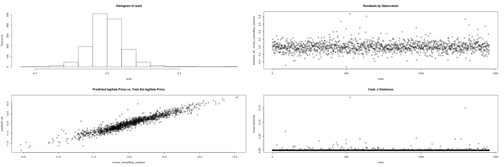

```{r setup, include=FALSE}

knitr::opts_chunk$set(echo = TRUE)

rm(list=ls())

library(ggplot2)
library(MASS)
library(car)

home_dir <- "~/_smu/_src/home_prices/"
setwd(home_dir)
data_dir <- "./data"


```

## House Prices - à la Kaggle - Homework 13

###Analysis Question 2  

***  

#### __Statement of Problem__  

Estimating market value of a home for sale has significant implications for all parties involved in the transaction : seller, buyer, agents, mortgage providers and even local taxing authorities. Getting it right can improve local economies. Inefficiencies associated to historical methods of value assessments create hesitation on the part of buyers and lenders, and potential loss of revenue for sellers and agents. Developing a model that considers all available factors and provides a transparent valuation that can be shared among all parties in the transaction can enable the participants to proceed with increased confidence, thus increasing the velocity of the local real estate market.  
That is the purpose of this evaluation : use all available contributing factors for the residnetial real estate market in Ames, Iowa and create a predicitve model to better estimate market valuation for future properties to be proposed for sale.  
  
***  

#### __Data Available & Utilized__  

For this evaluation, there are seventy-nine explanatory variables available for exploitation, based on residential sales in the years 2006 trough 2010, comprising approximately 1500 sales. The explanatory variables include traditional expected characteristics, such as : neighborhood, square footage, number of bedrooms, number of bathrooms, etc. and also several factors that are perhaps considered secondary or tertiary, but are included in the modeling to increase predictive capability. Some of these additional factors include : heating type, number of fireplaces, qualitative assessment of the kitchen condition.  
  
***  
  
#### __Model Construction__  

In order to build the model, the following steps are taken :
* read in the raw training data set provided,  
* basic cleaning of the data, including removing significant outliers (for this purpose, more than 5 std deviations from mean)  
* imputing values for features where none was provided (for this purpose, setting to min value for numeric features, and creating a new factor level "None" for categorical features),  
 * plot and visually examine each feature in relation to log(SalePrice) ...  
+ this provides a basis for removing some features from consideration based on inspection  
  	+ some features may have 1400 / 1460 within same cateegory, thus not providing varaibility worthwhile including in a model  
  	+ some numerical features are sparesely populated, and the the few values visually exhibit zero slope in relation to log(SalePrice)  
  	+ a new feature was created "saledate" from the "year sold" and "month sold" features. Upon visual examination, there was no obvious trend in the time series view for  log(SalePrice)s, so this was eventually discarded (surprisingly, considering that the time period spanned the economic downturn to 2007 - 2009).   
  	+ this visual examination then results in eliminating approximately 25 of the features from consideration in the model.  
  	+ (All of the plots are available for review in the appendix, "homes_train_plots.pdf", if desired for review)

***  

#### __Models Considered__  

In all cases, the basic data set consists of 52 predictor variables and the dependent output variable log(SalePrice)

Four different models are built :  
	*		Stepwise  - using the R package stepAIC()  
	*		Forward   - using the R package stepAIC()  
	*		Backward  - using the R package stepAIC()  
	*		CUSTOM 	- this method using an iterative loop to evaluate the VIF for each contributor in the current model, eliminates the feature with the highest VIF, and continues until max(VIF) remaining in the model is < 5  
  
  ***  
  
  #### __Residuals Evaluation__	   
* the following plots show the distribution of residuals and the predicted vs. the actual sale price (log scale) for the custom model. From these plots, we consider that the basic assumptions of normality in the residuals is achieved, and that the visual aspect of the fitted model aligns well with the dependent variable to be modeled. For brevity's sake, the only plots shown here are for the custom model. The residuals plots for the other models assessed were similar in nature.

			

	
#### __Influential point analysis (Cook’s D and Leverage)__  
* Similarly, the Cook's Distance is assessed for the fitted model : all values are significantly less than 1; with this large data set, there are no individual points which are signficantly affecting model resutls, either from perspective of leverage or influence based on Cook's distance for this model. Thus, model is appropriate to maintain the complete modeled data set. This is shown in the above figure.

***  

#### __Comparing Competing Models__  
		
#### Adj R2     
			- forward : 0.93
			- backward : 0.93
			- step : 0.93
			- custom : 0.90
			
#### Kaggle Score   
			- forward : 0.38
			- backward : 0.38
			- step : 0.38
			- custom : 0.24

***  			
  
### __Conclusion:__   

* For this effort, the 4 models each provide good predictive capability for estimating market valuation of residential real estate to be proposed for offering in the Ames, Iowa market. The custom model outperformed the stepwise, forward addition and backward elimination methods for the features chosen in this case.  

***  

#### __Appendix__  

The code to complete this analysis can be found at this github site :
https://github.com/bici-sancta/home_prices

The complete set of plots used to downselect to the modeled features along with the residual plots for the remaining models are also found here : https://github.com/bici-sancta/home_prices/blob/master/homes_train_plots.pdf

The screen shot of the Kaggle scores associated to this model is found at this location : https://github.com/bici-sancta/home_prices/blob/master/kaggle_scores.png
	 
***